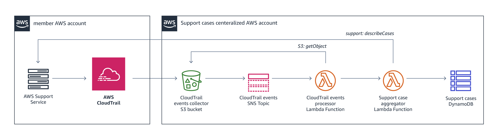

# AWS Support Cases Aggregator
_AWS Support Cases aggregation for a multi-account organization_

[](https://github.com/Snapchat/aws-support-tickets-aggregator/actions?query=workflow%3Aci+branch%3Amaster)

This is a simple CloudFormation-based serverless pipeline for collecting support case information from all users across an AWS Organization into a single database.

This allows users to easily discover and monitor all Support Cases within an organization. See our [AWS Blog Post](https://aws.amazon.com/blogs/mt/) for details.

### AWS Support Cases Aggregator Architecture



### Topology - Hub and Spoke
This service uses a Hub (central aggregator account) and Spoke (member accounts) model.
The aggregator can be configured in two ways:

1. Aggregator account is [AWS Organizations master account](docs/hub-spoke-topology.md#using-org-master-as-central-aggregator-account)

2. Aggregator account is [NOT AWS Organizations master account](docs/hub-spoke-topology.md#using-separate-org-master-and-central-aggregator-accounts)


### Setup
#### Central Aggregator Account (Hub)
Ensure you have permissions for creating requisite AWS resources including IAM roles and policies.

##### Prerequisite Steps
1. Create a S3 bucket in your central aggregator account to hold the CloudFormation stack template. Pass the bucket name to the `--cf_s3_bucket` parameter of the `run_cloudformation.sh` script.

    > The CloudFormation stack must be created in the same region as the aforementioned S3 bucket.

2. Choose a free name for your CloudTrail S3 bucket. Pass it to the `--ct_s3_bucket` parameter of the `run_cloudformation.sh` script.

    > Ensure a bucket with the same name does not already exist, or the CloudFormation stack will fail to create.

    > The CloudFormation stack will handle bucket creation.

3. (Optional) If your aggregator account will not be your AWS Organizations master account:
    * Pass the role arn `arn:aws:iam::<ORG MASTER ACCOUNT ID>:role/OrgListAccountsViewer` to the `--org_role` parameter of the `run_cloudformation.sh` script.
    > Note this role can be created in section [AWS Organizations Master Account #2](#aws-organizations-master-account)

##### Creating the CloudFormation Stack
Run the shell script:

```bash
./run_cloudformation.sh --profile=<profile_name> --stack_name=<stack name> --cf_region=<cloudformation region> --cf_s3_bucket=<cloudformation s3 bucket> --ct_s3_bucket=<cloudtrail S3 bucket> [--template_file=<template file> --org_role=<org master role>]
```

> For instructions on how to set up an AWS command line profile, see the [AWS documentation](https://docs.aws.amazon.com/cli/latest/userguide/cli-configure-profiles.html).

You may use any name in the `<stack name>` parameter (e.g. `central-support`).

###### Setting the CloudTrail S3 Bucket
CloudTrail trails from every account you wish to monitor must be deposit their events into the newly created CloudTrail S3 bucket specified in the `--ct_s3_bucket` parameter above.

If you are using an organization CloudTrail trail, you only need to modify that organization trail S3 bucket location. If not, you must set a CloudTrail trail in every member account you wish to monitor to use the newly created S3 bucket.

#### Member Account (Spoke)
Create an IAM role called `GetSupportInfoRole` in every member account with `support:` and `support:Describe*` permissions that trusts the `SupportAggregator` role in the central aggregator account.

> For specific details, follow instructions [here.](docs/member_acc_role_setup.md)


#### AWS Organizations Master Account
1. Create an `organization trail` in your AWS organizations master account and configure the CloudTrail service to send events to your CloudTrail bucket.
    > For details on organization trails, see the AWS docs on [Creating a Trail for an Organization](https://docs.aws.amazon.com/awscloudtrail/latest/userguide/creating-trail-organization.html).

    > Deposit CloudTrail events into the CloudTrail S3 bucket specified in [central aggregrator prerequisites #2](#prerequisite-steps).

    > You may also configure individual member accounts with CloudTrail trails that send events to the CloudTrail S3 bucket.

2. (Optional) If your aggregator account will not be your AWS Organizations master account:
    * Create an IAM Role `OrgListAccountsViewer` in the AWS Organizations master account that trusts central aggregator account and has role policy with `organizations:ListAccounts` actions. For specific details, follow instructions [here.](docs/org_master_role_setup.md)


### Periodic Scanning
This pipeline scans case data from the past 60 days every 3 days. You can configure the scan to get all historical case data by setting `get_all_existing_cases(recent_cases_only=False)` in `support_cases_aggregator.py`.

If you do not use AWS Organizations, modify [list_account_ids()](src/support_cases_aggregator.py#L31) in `support_cases_aggregator.py` to return a list of strings of the account ids you want to monitor support cases for.

## Project Resources
[Development Guide](./docs/development.md)

[Contributing Guide](./CONTRIBUTING.md)

## License

[The MIT License](http://opensource.org/licenses/MIT)

Copyright (c) 2019 Snap Inc.
